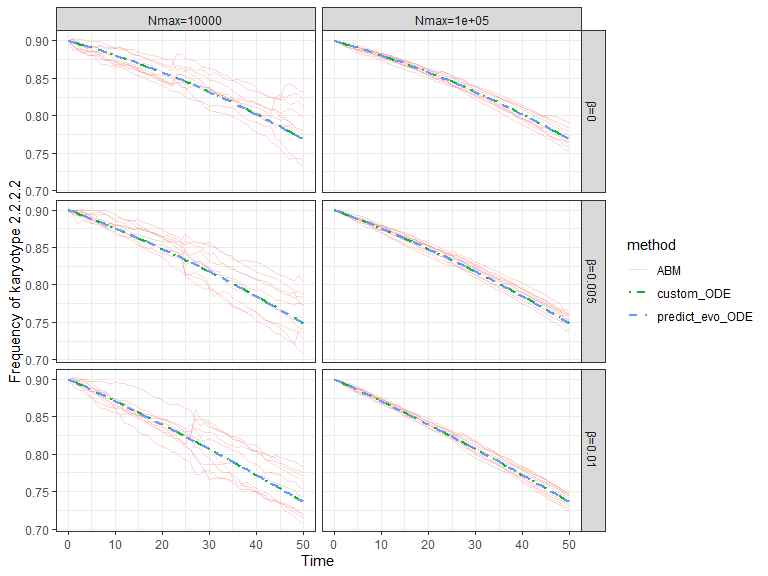

Demonstrating `predict_evo` and `alfak` in alfakR
================
RJB

## Introduction

This vignette demonstrates key functionalities of the `alfakR` package.
We will primarily focus on:

1.  **`predict_evo`**: Simulating karyotype evolution using both
    Ordinary Differential Equation (ODE) models and Agent-Based Models
    (ABM). We will compare the `predict_evo` ODE output to a custom ODE
    implementation based on Kimmel et al. (2023) to serve as a ground
    truth.
2.  **`alfak`**: Recovering fitness estimates from karyotype count data.

## Demonstrating `predict_evo`

We will simulate the evolution of karyotype frequencies under different
missegregation rates ($\beta$) and population ceilings ($N_{max}$).

### Setup: Parameters and Libraries

First, we define the simulation parameters and load necessary libraries.

``` r
misseg_rates <- c(0, 0.005, 0.01)
abm_max_vec  <- c(1e4, 1e5)
replicates   <- 10 # Number of ABM replicates
sim_times    <- seq(0, 50, by = 1)

library(alfakR); library(deSolve); library(ggplot2); library(utils)
#> Warning: package 'ggplot2' was built under R version 4.4.3
```

The following helper functions are used to construct a custom ODE model
for comparison purposes, based on the model described in Kimmel, G. J.,
et al. (2023). *PLOS Computational Biology*, *19*(1), e1010815.

``` r
pij <- function(i,j,beta){ if(abs(i-j)>i) return(0); if(j==0) j <- 2*i;
sum(choose(i, seq(abs(i-j), i, 2))*beta^(seq(abs(i-j), i, 2))*
    (1-beta)^(i-seq(abs(i-j), i, 2))*0.5^seq(abs(i-j), i, 2)*
    choose(seq(abs(i-j), i, 2), (seq(abs(i-j), i, 2)+i-j)/2)) }
get_A <- function(kary_list,g,beta) matrix(sapply(1:2, function(i)
  sapply(1:2, function(j){ q<-prod(sapply(1:length(kary_list[[1]]),
                                        function(k) pij(kary_list[[i]][k], kary_list[[j]][k], beta))); if(i==j)
                                          g[i]*(2*q-1) else g[i]*2*q })),2,2,byrow=TRUE)
chrmod <- function(t,state,parms) list(state%*%parms$A)
vec <- function(s) as.numeric(strsplit(s,"[.]")[[1]])
```

### Landscape and Initial State

We define a simple fitness landscape with two karyotypes and their
initial frequencies.

``` r
landscape_df <- data.frame(k=c("2.2.2.2","2.2.2.3"), mean=c(0.1,0.12))
init <- c(0.9,0.1); names(init) <- landscape_df$k
kary_list <- lapply(landscape_df$k, vec); g <- landscape_df$mean 
```

### Simulation Loop

We now loop through the defined missegregation rates and population
ceilings, running simulations with `predict_evo` (ODE and ABM) and the
custom ODE model.

``` r
results <- list(); idx <- 1
for(beta_val in misseg_rates) for(max_pop_val in abm_max_vec){ 
  pop_size <- max_pop_val/10
  
  ode1 <- predict_evo(lscape=landscape_df,p=beta_val,times=sim_times,x0=init,
                      prediction_type="ODE")
  ode1_df <- data.frame(time=sim_times,freq=ode1[,2],method="predict_evo_ODE",
                        beta=beta_val,beta_lbl=paste0("β=",beta_val),
                        pop=max_pop_val,pop_lbl=paste0("Nmax=",max_pop_val),rep=max_pop_val)
  
  A <- get_A(kary_list,g,beta_val)
  ode2 <- deSolve::ode(y=init,func=chrmod,parms=list(A=A),times=sim_times)
  # Ensure the correct column is selected by name and then normalized
  ode2_df <- data.frame(time=sim_times,freq=ode2[,2]/rowSums(ode2[,2:3]),
                        method="custom_ODE",beta=beta_val,beta_lbl=paste0("β=",beta_val),
                        pop=max_pop_val,pop_lbl=paste0("Nmax=",max_pop_val),rep=max_pop_val)
  results[[idx]] <- rbind(ode1_df,ode2_df); idx <- idx+1
  
  for(r_val in 1:replicates){ 
    abm <- predict_evo(lscape=landscape_df,p=beta_val,times=sim_times,x0=init,
                       prediction_type="ABM",abm_pop_size=pop_size,
                       abm_delta_t=0.01,abm_max_pop=max_pop_val,abm_record_interval=100)
    results[[idx]] <- data.frame(time=sim_times,freq=unlist(abm[,2]),method="ABM",
                                 beta=beta_val,beta_lbl=paste0("β=",beta_val),
                                 pop=max_pop_val,pop_lbl=paste0("Nmax=",max_pop_val),
                                 rep=r_val) 
    idx <- idx+1 }
}
res <- do.call(rbind, results)
```

### Plotting Results

The combined results are plotted to visualize the frequency dynamics.
The plot will show the frequency of the first karyotype (2.2.2.2).

``` r
sc <- scale_linetype_manual(values=c(ABM="solid",predict_evo_ODE="dashed",
                                     custom_ODE="dotdash"))
ac <- scale_alpha_manual(values=c(ABM=0.3,predict_evo_ODE=1,custom_ODE=1))
ss <- scale_size_manual(values=c(ABM=0.3,predict_evo_ODE=0.8,custom_ODE=0.8))

ggplot(res,aes(time,freq,group=interaction(method,rep),color=method))+
  geom_line(aes(linetype=method, alpha=method, size=method))+
  facet_grid(beta_lbl~pop_lbl)+
  labs(x="Time",y=paste("Frequency of karyotype", landscape_df$k[1]))+
  theme_bw() + sc + ac + ss
#> Warning: Using `size` aesthetic for lines was deprecated in ggplot2 3.4.0.
#> ℹ Please use `linewidth` instead.
#> This warning is displayed once every 8 hours.
#> Call `lifecycle::last_lifecycle_warnings()` to see where this warning was
#> generated.
```

<!-- -->

### Interpretation of `predict_evo` Output

The figure above displays the frequency of karyotype 2.2.2.2 over time
under various conditions.

- The **`predict_evo_ODE`** (dashed lines) represents the deterministic
  predictions from `alfakR`.
- The **`custom_ODE`** (dot-dashed lines) represents predictions from
  the ground truth model based on Kimmel et al. (2023).
- The **`ABM`** (solid, semi-transparent lines) shows individual
  stochastic simulations from `predict_evo`.

As can be seen, the `predict_evo_ODE` results closely match the
`custom_ODE` outputs, validating the ODE implementation within
`predict_evo`. The ABM simulations show stochastic variation around
these deterministic trajectories, as expected.

## Exemplar: Using `alfak` to Recover Fitness Estimates

The `alfak` function can be used to infer karyotype fitness values from
time-series count data. Here, we simulate data using the custom ODE
model and then attempt to recover the original fitness parameters.

### Data Simulation and Preparation

We first simulate karyotype dynamics using the custom ODE model. For
this example, we will use $\beta = 0.01$.

``` r
beta_for_alfak <- tail(misseg_rates,1) 
A_alfak <- get_A(kary_list,g,beta_for_alfak) 
x_sim <- deSolve::ode(y=init,func=chrmod,parms=list(A=A_alfak),times=sim_times)
```

We then sample from these ODE-predicted frequencies to generate
plausible counts data, mimicking experimental observations. We select
time points from 5 to 45, with a step of 5.

``` r
time_indices_for_counts <- sim_times %in% seq(5,45,5)
# Ensure x_sim has a time column to exclude if it's part of the output from deSolve::ode
# The default output of ode includes time as the first column.
# We need to select states corresponding to landscape_df$k
# And ensure probabilities for rmultinom are non-negative and sum to 1.
x_states_all <- x_sim[, -1, drop=FALSE] # Exclude time column
x_sampled <- x_states_all[time_indices_for_counts, , drop=FALSE] 

# Ensure probabilities are correctly normalized for rmultinom
prob_func <- function(row_vec) {
  row_vec_norm <- pmax(0, row_vec) # Ensure non-negative
  if(sum(row_vec_norm) == 0) { # Handle case where all probs are zero (e.g. after pmax)
    return(rep(1/length(row_vec_norm), length(row_vec_norm))) # Assign equal probability
  }
  return(row_vec_norm / sum(row_vec_norm))
}

counts <- data.frame(apply(x_sampled,1,function(xi) rmultinom(n=1,size=200,prob=prob_func(xi)))) 
colnames(counts) <- seq(5,45,5) 
rownames(counts) <- landscape_df$k
yi <- list(x=counts,dt=1) 
```

### Running `alfak` (Initial Attempt)

Now, we run `alfak` on this simulated dataset. The `outdir` for `alfak`
will create a subdirectory containing output within our working
directory.

``` r
alfak_output_subdir1 <- "alfakR_tmp_run1" 
console_out <- utils::capture.output(xv <- alfak(yi,outdir=alfak_output_subdir1,passage_times = as.numeric(colnames(yi$x)),minobs = 10,nboot=20,pm=beta_for_alfak,n0=1e5,nb=1e7))
print(head(console_out))
#> [1] "Warning: "                                                                            
#> [2] "Grid searches over lambda (nugget and sill variances) with  minima at the endpoints: "
#> [3] "  (REML) Restricted maximum likelihood "                                              
#> [4] "   minimum at  right endpoint  lambda  =  1878.024 (eff. df= 5.001285 )"              
#> [5] "Warning: "                                                                            
#> [6] "Grid searches over lambda (nugget and sill variances) with  minima at the endpoints: "
```

This is a toy example. The cross-validation score (`xv$score`) is likely
low, and the kriging-fitted landscape is likely unreliable. During the
execution of `alfak`, some warnings related to the kriging process
(specifically, “Grid searches over lambda …”) may appear. These indicate
that the optimization for variance components in the spatial smoothing
model found its best solution at the edge of the parameter search space.
This is not uncommon in examples with sparse data or simple underlying
fitness landscapes, as is the case with this toy example.

``` r
landscape_rds_path1 <- file.path(alfak_output_subdir1, "landscape.Rds")
if(file.exists(landscape_rds_path1)){
  lscape_alfak1 <- readRDS(landscape_rds_path1)
  print("Kriging fitted landscape (Initial):")
  head(lscape_alfak1)
} else {
  print(paste("landscape.Rds not found in", landscape_rds_path1))
}
#> [1] "Kriging fitted landscape (Initial):"
#>         k      mean    median          sd    fq    nn
#> 1 2.2.2.2 0.9656604 0.9658675 0.002957255  TRUE FALSE
#> 2 2.2.2.3 0.9064188 0.9061329 0.002039167  TRUE FALSE
#> 3 1.2.2.2 0.9666098 0.9664881 0.005711241 FALSE  TRUE
#> 4 3.2.2.2 0.9647157 0.9650623 0.004595568 FALSE  TRUE
#> 5 2.1.2.2 0.9663851 0.9653318 0.007382381 FALSE  TRUE
#> 6 2.3.2.2 0.9649400 0.9647802 0.004486671 FALSE  TRUE
```

The relative stage 1 fitness estimates can still be informative.

``` r
boot_res_rds_path1 <- file.path(alfak_output_subdir1, "bootstrap_res.Rds")
if(file.exists(boot_res_rds_path1)){
  boot_res1 <- readRDS(boot_res_rds_path1)
  print("Median inferred fitness (Stage 1 - Initial):")
  print(apply(boot_res1$final_fitness,2,median))
  print("Original fitness values:")
  print(landscape_df)
} else {
  print(paste("bootstrap_res.Rds not found in", boot_res_rds_path1))
}
#> [1] "Median inferred fitness (Stage 1 - Initial):"
#>   2.2.2.2   2.2.2.3 
#> 0.9183091 0.9552364 
#> [1] "Original fitness values:"
#>         k mean
#> 1 2.2.2.2 0.10
#> 2 2.2.2.3 0.12
```

Note that the absolute values of the stage 1 fitness estimates might not
match the true values directly. `alfakR` uses passage times (`dt`) to
calibrate absolute fitness.

### Calibrating Fitness Estimates with Realistic Passage Times

The growth rate of the dominant cell population can inform `dt`. If the
population grows exponentially from $N_0$ to $N_B$ before passaging, and
its growth rate is $m$, then $dt = \log(N_B/N_0)/m$.

``` r
mean_growth_rate <- landscape_df$mean[1] 
nb_val <- 1e6 
n0_val <- 1e5 
dt_realistic <- log(nb_val/n0_val)/mean_growth_rate
print(paste("Calculated dt:", dt_realistic))
#> [1] "Calculated dt: 23.0258509299405"
```

Let’s re-simulate the ODE model with these more “realistic” passage
intervals.

``` r
A_alfak_realistic <- get_A(kary_list,g,beta_for_alfak) 
total_sim_time_realistic <- 5 * dt_realistic # Simulate for a few passages
passage_sim_times <- seq(0, total_sim_time_realistic, by=dt_realistic)
if(length(passage_sim_times) < 2) passage_sim_times <- c(0, dt_realistic) # Ensure at least one interval

x_sim_realistic <- deSolve::ode(y=init,func=chrmod,parms=list(A=A_alfak_realistic),times=passage_sim_times)
```

Prepare the data for `alfak` again.

``` r
# Exclude initial state at t=0 and the time column
x_states_realistic_all <- x_sim_realistic[-1, -1, drop=FALSE] 
counts_realistic <- data.frame(apply(x_states_realistic_all,1,function(xi) rmultinom(n=1,size=200,prob=prob_func(xi))))
colnames(counts_realistic) <- 1:ncol(counts_realistic) 
rownames(counts_realistic) <- landscape_df$k
yi_realistic <- list(x=counts_realistic,dt=dt_realistic)
```

### Running `alfak` with Calibrated `dt`

``` r
alfak_output_subdir2 <- "alfakR_tmp_run2"
console_out <- utils::capture.output(xv_realistic <- alfak(yi_realistic,outdir=alfak_output_subdir2,passage_times = as.numeric(colnames(yi_realistic$x)),minobs = 10,nboot=20,pm=beta_for_alfak,n0=n0_val,nb=nb_val))

boot_res_rds_path2 <- file.path(alfak_output_subdir2, "bootstrap_res.Rds")
if(file.exists(boot_res_rds_path2)){
  boot_res_realistic <- readRDS(boot_res_rds_path2)
  print("Median inferred fitness (Stage 1 - Calibrated dt):")
  print(apply(boot_res_realistic$final_fitness,2,median))
  print("Original fitness values:")
  print(landscape_df)
} else {
  print(paste("bootstrap_res.Rds not found in", boot_res_rds_path2))
}
#> [1] "Median inferred fitness (Stage 1 - Calibrated dt):"
#>    2.2.2.2    2.2.2.3 
#> 0.09760208 0.11629140 
#> [1] "Original fitness values:"
#>         k mean
#> 1 2.2.2.2 0.10
#> 2 2.2.2.3 0.12
```

With `dt` calibrated, the absolute fitness estimates from `alfak` should
now be closer to the original fitness values defined in `landscape_df`.

## Conclusion

This vignette has demonstrated the use of `predict_evo` for simulating
karyotype evolution and validated its ODE component against a custom
model. It also provided an example of how to use the `alfak` function to
infer fitness landscapes from simulated count data, highlighting the
importance of calibrating passage times (`dt`) for accurate absolute
fitness estimation.

    #> R version 4.4.1 (2024-06-14 ucrt)
    #> Platform: x86_64-w64-mingw32/x64
    #> Running under: Windows 10 x64 (build 19045)
    #> 
    #> Matrix products: default
    #> 
    #> 
    #> locale:
    #> [1] LC_COLLATE=English_United States.utf8 
    #> [2] LC_CTYPE=English_United States.utf8   
    #> [3] LC_MONETARY=English_United States.utf8
    #> [4] LC_NUMERIC=C                          
    #> [5] LC_TIME=English_United States.utf8    
    #> 
    #> time zone: America/New_York
    #> tzcode source: internal
    #> 
    #> attached base packages:
    #> [1] stats     graphics  grDevices utils     datasets  methods   base     
    #> 
    #> other attached packages:
    #> [1] ggplot2_3.5.2     deSolve_1.40      alfakR_0.0.0.9000
    #> 
    #> loaded via a namespace (and not attached):
    #>  [1] Matrix_1.7-0      gtable_0.3.5      highr_0.11        crayon_1.5.3     
    #>  [5] dplyr_1.1.4       compiler_4.4.1    maps_3.4.2        tidyselect_1.2.1 
    #>  [9] Rcpp_1.0.13       tidyr_1.3.1       scales_1.3.0      yaml_2.3.10      
    #> [13] fastmap_1.2.0     lattice_0.22-6    R6_2.5.1          labeling_0.4.3   
    #> [17] generics_0.1.3    knitr_1.48        dotCall64_1.1-1   tibble_3.2.1     
    #> [21] munsell_0.5.1     pillar_1.10.2     rlang_1.1.4       xfun_0.47        
    #> [25] quadprog_1.5-8    viridisLite_0.4.2 cli_3.6.3         withr_3.0.1      
    #> [29] magrittr_2.0.3    digest_0.6.37     grid_4.4.1        rstudioapi_0.16.0
    #> [33] spam_2.10-0       lifecycle_1.0.4   fields_16.3       vctrs_0.6.5      
    #> [37] RSpectra_0.16-2   evaluate_0.24.0   glue_1.7.0        farver_2.1.2     
    #> [41] colorspace_2.1-1  rmarkdown_2.28    purrr_1.0.2       tools_4.4.1      
    #> [45] pkgconfig_2.0.3   htmltools_0.5.8.1
